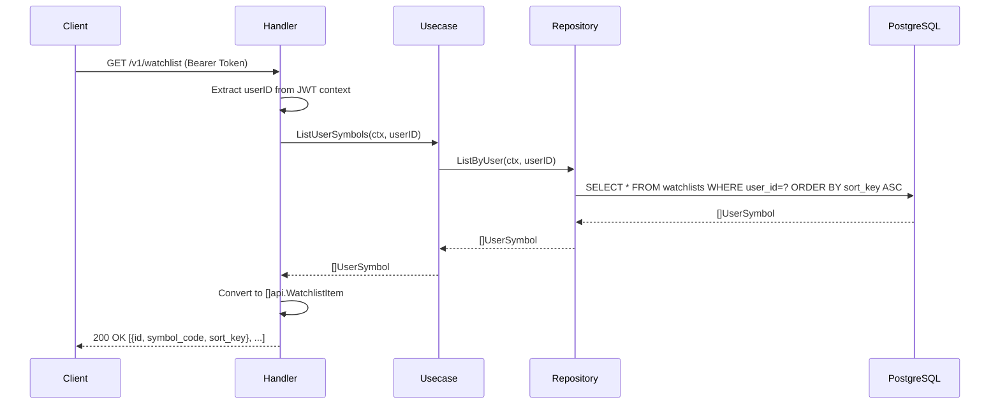
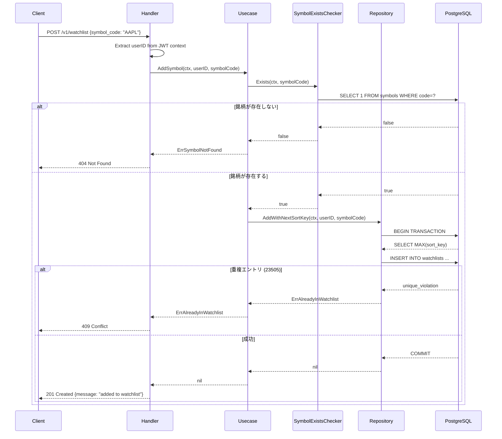
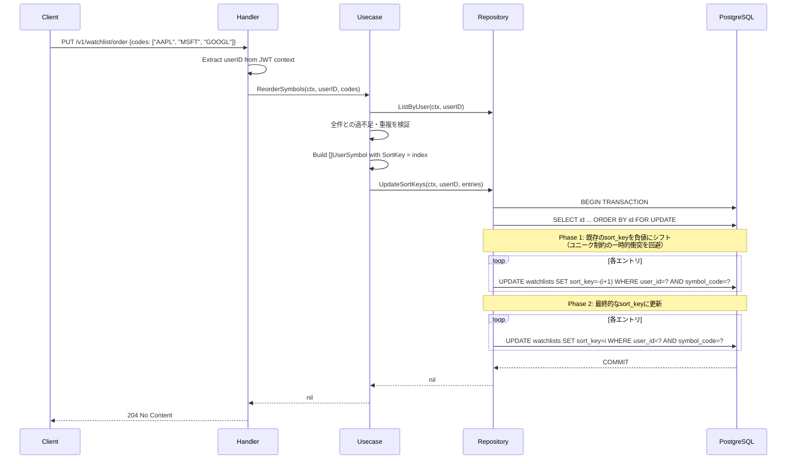

# Watchlist フィーチャー

## 概要

Watchlistフィーチャーは、ユーザーごとのウォッチリスト（お気に入り銘柄リスト）管理を提供します。銘柄の追加・削除・並び順変更を REST API 経由で操作できます。

### 主な機能

- **ウォッチリスト取得**: ログインユーザーの銘柄リストをソート順で返却
- **銘柄追加**: `symbols` テーブルに存在する銘柄のみ追加可（重複防止）
- **銘柄削除**: ウォッチリストから銘柄を削除
- **並び順変更**: ウォッチリストの表示順を一括更新
- **デフォルト銘柄初期化**: 新規ユーザーサインアップ時に AAPL/MSFT/GOOGL を自動追加

## シーケンス図

### ウォッチリスト取得フロー



### 銘柄追加フロー



### 並び順変更フロー



## API仕様

### GET /v1/watchlist

ログインユーザーのウォッチリストを `sort_key` 昇順で取得します。JWT認証が必要です。

**認証方式**（優先順位順）:
1. `auth_token` Cookie（ブラウザクライアント。GETのためCSRFトークンは不要）
2. `Authorization: Bearer <token>` ヘッダー（APIクライアント・curl等）

**レスポンス**

- **200 OK** - 成功
  ```json
  [
    {"id": 1, "symbol_code": "AAPL", "sort_key": 0},
    {"id": 2, "symbol_code": "MSFT", "sort_key": 1},
    {"id": 3, "symbol_code": "GOOGL", "sort_key": 2}
  ]
  ```

---

### POST /v1/watchlist

ウォッチリストに銘柄を追加します。JWT認証が必要です。Cookie認証ではCSRFトークンも必要ですが、Bearer認証では不要です。

**リクエストボディ**
```json
{"symbol_code": "AAPL"}
```

**レスポンス**

| ステータス | 説明 |
|-----------|------|
| 201 Created | 追加成功 `{"message": "added to watchlist"}` |
| 400 Bad Request | リクエストボディが不正 |
| 401 Unauthorized | JWTが未指定または無効 |
| 403 Forbidden | Cookie認証時のCSRFトークンが不正 |
| 404 Not Found | `symbols` テーブルに存在しない銘柄コード |
| 409 Conflict | 既にウォッチリストに登録済みの銘柄 |
| 500 Internal Server Error | サーバー内部エラー |

---

### DELETE /v1/watchlist/{code}

ウォッチリストから銘柄を削除します。JWT認証が必要です。Cookie認証ではCSRFトークンも必要ですが、Bearer認証では不要です。

**パスパラメータ**
| パラメータ | 説明 | 例 |
|-----------|------|-----|
| `code` | 銘柄コード | `AAPL`, `7203.T` |

**レスポンス**

| ステータス | 説明 |
|-----------|------|
| 204 No Content | 削除成功 |
| 400 Bad Request | 銘柄コードの形式が不正 |
| 401 Unauthorized | JWTが未指定または無効 |
| 403 Forbidden | Cookie認証時のCSRFトークンが不正 |
| 404 Not Found | ウォッチリストに存在しない銘柄 |
| 500 Internal Server Error | サーバー内部エラー |

---

### PUT /v1/watchlist/order

ウォッチリストの並び順を一括更新します。JWT認証が必要です。Cookie認証ではCSRFトークンも必要ですが、Bearer認証では不要です。

**リクエストボディ**
```json
{"codes": ["AAPL", "MSFT", "GOOGL"]}
```
配列の順番が新しい `sort_key`（0始まりインデックス）として設定されます。

**レスポンス**

| ステータス | 説明 |
|-----------|------|
| 204 No Content | 更新成功 |
| 400 Bad Request | リクエストボディが不正、または`codes`が現在のウォッチリスト全件と一致しない |
| 401 Unauthorized | JWTが未指定または無効 |
| 403 Forbidden | Cookie認証時のCSRFトークンが不正 |
| 500 Internal Server Error | サーバー内部エラー |

## 依存関係図

```mermaid
graph TB
    subgraph "Transport Layer"
        Handler[Handler<br/>watchlisthttp]
        UCInterface[Usecase Interface<br/>watchlisthttp/handler.go]
    end

    subgraph "API Types (Generated)"
        APITypes[WatchlistItem / AddWatchlistRequest<br/>ReorderWatchlistRequest<br/>internal/api/types.gen.go]
    end

    subgraph "Usecase Layer"
        WatchlistUC[Usecase<br/>usecase.go]
        RepoInterface[Repository Interface<br/>usecase.go]
        SymbolInterface[SymbolExistsChecker Interface<br/>usecase.go]
        Errors[Domain Errors<br/>errors.go]
    end

    subgraph "Domain Layer"
        Entity[UserSymbol Entity<br/>user_symbol.go]
    end

    subgraph "Adapters Layer"
        RepoImpl[repository<br/>repository.go]
    end

    subgraph "External Feature (via Interface)"
        SymbolChecker[symbollist SymbolRepository<br/>（SymbolExistsCheckerを実装）]
    end

    subgraph "External Dependencies"
        DB[(PostgreSQL<br/>watchlists テーブル)]
    end

    Handler -->|depends on| UCInterface
    Handler -->|uses| APITypes
    Handler -->|uses| Errors
    WatchlistUC -.->|implements| UCInterface
    WatchlistUC -->|defines| RepoInterface
    WatchlistUC -->|defines| SymbolInterface
    WatchlistUC -->|uses| Entity
    WatchlistUC -->|uses| Errors
    RepoImpl -.->|implements| RepoInterface
    RepoImpl -->|uses| Entity
    RepoImpl -->|accesses| DB
    SymbolChecker -.->|implements| SymbolInterface

    style Handler fill:#e1f5ff
    style UCInterface fill:#e1f5ff
    style WatchlistUC fill:#fff4e1
    style RepoInterface fill:#fff4e1
    style SymbolInterface fill:#fff4e1
    style Errors fill:#fff4e1
    style Entity fill:#e8f5e9
    style RepoImpl fill:#f3e5f5
    style DB fill:#ffebee
    style SymbolChecker fill:#f3e5f5
```



### 依存関係の説明

#### トランスポート層（[watchlisthttp/handler.go](../../internal/feature/watchlist/watchlisthttp/handler.go)）
- **Handler**: HTTPリクエストを処理し、Usecaseを呼び出す
- **Usecase インターフェース**: watchlisthttp層で定義（Goの「インターフェースは利用者が定義する」慣例）
- **API型**（`internal/api/types.gen.go`）: OpenAPI仕様から自動生成された `api.WatchlistItem` 等を使用

#### ユースケース層（[usecase.go](../../internal/feature/watchlist/usecase.go)）
- **Usecase**: ウォッチリスト操作のビジネスロジック
- **Repository インターフェース**: 永続化層を抽象化（usecase層で定義）
- **SymbolExistsChecker インターフェース**: symbollist フィーチャーへの最小限の依存を表現。フィーチャー分離ルールに従い、symbollist の具体実装はインポートせずインターフェース経由で利用

#### ドメイン層（[user_symbol.go](../../internal/feature/watchlist/user_symbol.go)）
- **UserSymbol**: `watchlists` テーブルにマップされるエンティティ
  - `UserID`: 所有ユーザーID（FK: users.id）
  - `SymbolCode`: 銘柄コード（FK: symbols.code、最大20文字）
  - `SortKey`: 表示順（ユーザー内でユニーク制約）
- ユニーク制約: `(user_id, symbol_code)` および `(user_id, sort_key)`

#### アダプター層（[repository.go](../../internal/feature/watchlist/repository.go)）
- **repository**: RepositoryインターフェースのPostgreSQL実装
  - `ListByUser`: `sort_key ASC` 順でリスト返却
  - `Add`: エントリ追加（PostgreSQLエラーコードで `ErrAlreadyInWatchlist` / `ErrSymbolNotFound` に変換）
  - `AddWithNextSortKey`: `SELECT MAX(sort_key)` + INSERT をトランザクション内で実行し、`(user_id, sort_key)`ユニーク制約で重複順位を防止
  - `Remove`: 削除（`RowsAffected == 0` の場合 `ErrNotInWatchlist` を返す）
  - `UpdateSortKeys`: 2フェーズ更新でユニーク制約衝突を回避（負値シフト→最終値）

### アーキテクチャの特徴

1. **クリーンアーキテクチャ**: ドメイン層がインフラストラクチャから独立
2. **インターフェース所有権**: `Repository` は usecase 層で定義、`Usecase` は watchlisthttp 層で定義
3. **フィーチャー分離**: `SymbolExistsChecker` 最小インターフェースにより symbollist への直接依存を回避
4. **並行安全**: `AddWithNextSortKey` はトランザクションと`(user_id, sort_key)`ユニーク制約により重複 sort_key の永続化を防止（競合した追加は409になり得る）
5. **2フェーズ sort_key 更新**: ユニーク制約を一時的に違反しないよう、負値シフト後に最終値を設定

## ディレクトリ構成

```
watchlist/                            # package watchlist（コア）
├── user_symbol.go                    # UserSymbol エンティティ
├── usecase.go                        # ビジネスロジック + Repository / SymbolExistsChecker インターフェース
├── usecase_test.go                   # ユースケーステスト
├── errors.go                         # ErrSymbolNotFound / ErrAlreadyInWatchlist / ErrNotInWatchlist
├── repository.go                     # Repository の PostgreSQL 実装
├── repository_test.go                # リポジトリの統合テスト
├── repository_concurrent_test.go     # 並び順更新・削除の並行テスト
├── sqlc/                             # package watchlistsqlc（sqlc 生成コード）
│   ├── db.go
│   ├── models.go
│   ├── querier.go
│   ├── queries.sql
│   └── queries.sql.go
└── watchlisthttp/
    ├── handler.go                    # package watchlisthttp（HTTPハンドラー + Usecase インターフェース）
    └── handler_test.go               # HTTPハンドラーテスト
```

## テスト

現在は以下を実装しています。

- `usecase_test.go`: 一覧、追加、削除、全件一致を要求する並び替え、デフォルト銘柄初期化
- `repository_test.go`: PostgreSQLを使った追加・削除・2フェーズ並び順更新と制約エラー変換
- `repository_concurrent_test.go`: 並び順更新同士、および並び順更新と削除の競合
- `watchlisthttp/handler_test.go`: 各HTTPステータス、snake_caseリクエスト、入力検証、ドメインエラー変換

### テスト実行コマンド

```bash
# watchlist フィーチャー全テスト
go test ./internal/feature/watchlist/... -v -race -cover
```
