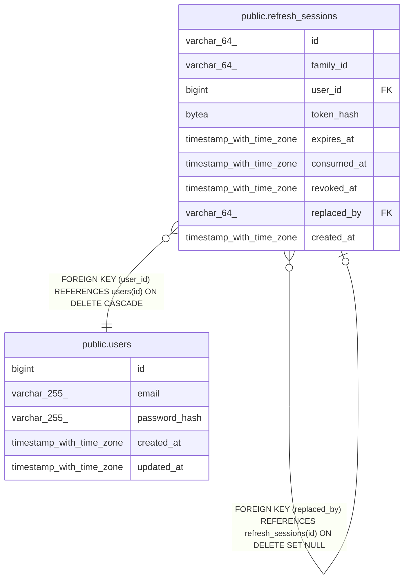

# public.refresh_sessions

## Columns

| Name | Type | Default | Nullable | Children | Parents | Comment |
| ---- | ---- | ------- | -------- | -------- | ------- | ------- |
| id | varchar(64) |  | false | [public.refresh_sessions](public.refresh_sessions.md) |  |  |
| family_id | varchar(64) |  | false |  |  |  |
| user_id | bigint |  | false |  | [public.users](public.users.md) |  |
| token_hash | bytea |  | false |  |  |  |
| expires_at | timestamp with time zone |  | false |  |  |  |
| consumed_at | timestamp with time zone |  | true |  |  |  |
| revoked_at | timestamp with time zone |  | true |  |  |  |
| replaced_by | varchar(64) |  | true |  | [public.refresh_sessions](public.refresh_sessions.md) |  |
| created_at | timestamp with time zone | now() | false |  |  |  |

## Constraints

| Name | Type | Definition |
| ---- | ---- | ---------- |
| ck_refresh_sessions_token_hash_length | CHECK | CHECK ((octet_length(token_hash) = 32)) |
| refresh_sessions_created_at_not_null | n | NOT NULL created_at |
| refresh_sessions_expires_at_not_null | n | NOT NULL expires_at |
| refresh_sessions_family_id_not_null | n | NOT NULL family_id |
| refresh_sessions_id_not_null | n | NOT NULL id |
| refresh_sessions_token_hash_not_null | n | NOT NULL token_hash |
| refresh_sessions_user_id_not_null | n | NOT NULL user_id |
| fk_refresh_sessions_user | FOREIGN KEY | FOREIGN KEY (user_id) REFERENCES users(id) ON DELETE CASCADE |
| fk_refresh_sessions_replaced_by | FOREIGN KEY | FOREIGN KEY (replaced_by) REFERENCES refresh_sessions(id) ON DELETE SET NULL |
| refresh_sessions_pkey | PRIMARY KEY | PRIMARY KEY (id) |
| uq_refresh_sessions_token_hash | UNIQUE | UNIQUE (token_hash) |

## Indexes

| Name | Definition |
| ---- | ---------- |
| refresh_sessions_pkey | CREATE UNIQUE INDEX refresh_sessions_pkey ON public.refresh_sessions USING btree (id) |
| uq_refresh_sessions_token_hash | CREATE UNIQUE INDEX uq_refresh_sessions_token_hash ON public.refresh_sessions USING btree (token_hash) |
| idx_refresh_sessions_family_id | CREATE INDEX idx_refresh_sessions_family_id ON public.refresh_sessions USING btree (family_id) |
| idx_refresh_sessions_user_id | CREATE INDEX idx_refresh_sessions_user_id ON public.refresh_sessions USING btree (user_id) |
| idx_refresh_sessions_expires_at | CREATE INDEX idx_refresh_sessions_expires_at ON public.refresh_sessions USING btree (expires_at) |

## Relations

---

> Generated by [tbls](https://github.com/k1LoW/tbls)
